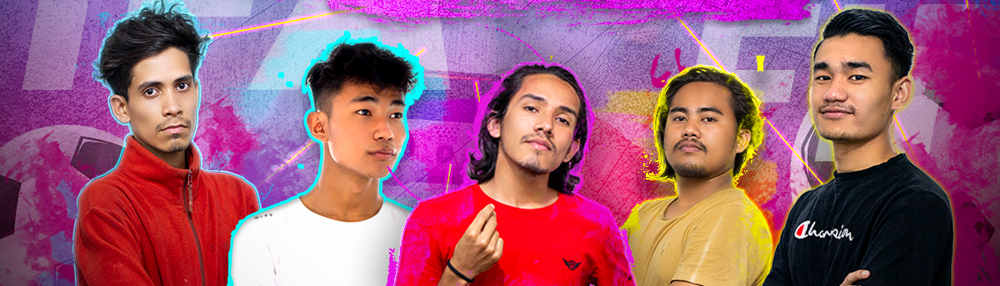

<!--  -->
<!-- #### Boys posing their Money Shots -->

 
 

<!-- ### LOVE | RESPECT | NO MERCY -->

<!-- 

 -->

[https://raisaroj360.com.np](https://raisaroj360.com.np)  
[https://bluecharicha.wordpress.com](https://bluecharicha.wordpress.com)  
[https://dioveath.itch.io](https://dioveath.itch.io)  
[https://prompters.dev](https://prompters.dev)  

 

 

